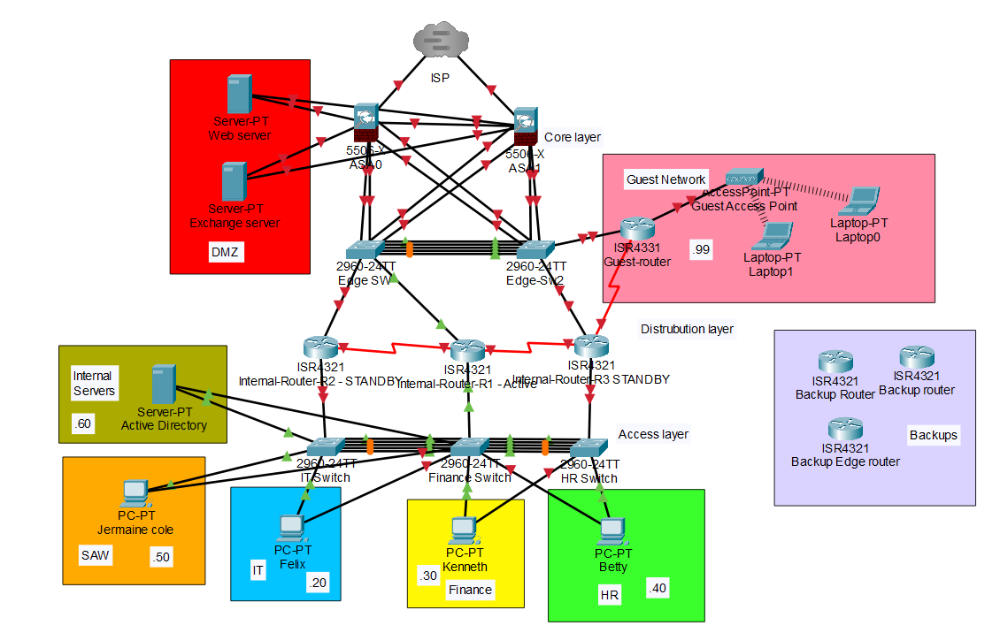

# SOHO Network - Capstone Project

## Mission
The goal of the project was to have a fully functional SOHO Network environment built on physical equipment and included:
* Cisco ASA Firewalls (Bonus)
* Routers
* Switches
* Wireless Access Point (Bonus)
* Active Directory
* Exchange Server
* Apache2 Webserver (Bonus)
* Network Redundancy
* Proper Internal Network Segmentation
* Internal/External Network Security
* Internet Connectivity

[View project documentation](https://github.com/adot8/SOHO-Network-Final-Capstone/blob/main/Final%20Documentation.pdf)
